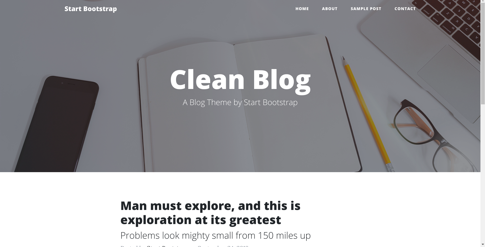

# Create Blog
This project is show of create now content and post this blog.
In this project can all user commen. this comment alll user see and review 
this result in this project implemented
1.	API-1- Registration: API to implement functionality for “User Registration”
2.	API-2 – Login: Implement functionality for “User Login”
3.	API-3 – CreateBlog:Logged in user shall be able to create blog (new rows into the table)
4.	API-4 – AddedBlog:Implement functionality to list all the blogs that are added
5.	API-5 – CommentBlog:User can comment on Blog base on Blog ID and User ID
6.	API-6 – SeeComment: User shall be able to see all added comments 

## Authors

- [@rajkumar060301](https://github.com/rajkumar060301)

## Features

- pratice API
- improve skills
- use in nodeJs and mongoDB
- use in development

## 🚀 About Me
I'm a full stack developer...

## 🔗 Links
[
[
[

## 24/08/2022
Preview like

Create new design

